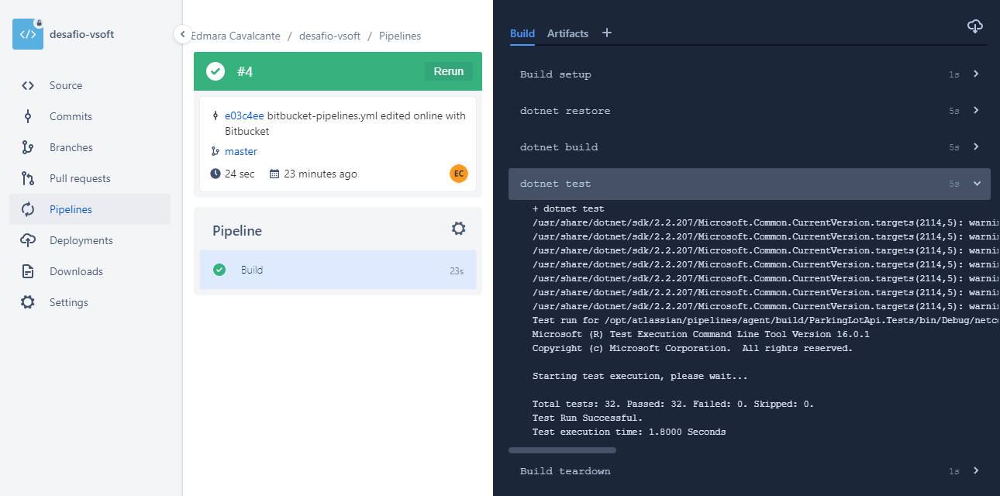

# **Desafio do Estacionamento de Carros**

# Motivação
Avaliar o desempenho de desenvolvedores ao desenvolver uma API RESTful documentada e testada e/ou um front-end para acesso à API.

# Introdução 
Você foi procurado para implementar uma API que gerencie um estacionamento privado de veículos.

O cliente não se importa com a tecnologia utilizada, desde que seja produtiva, eficiente, multi-plataforma e de fácil manutenção.

# Descrição do sistema
Criar uma API para gerenciamento de carros em um estacionamento, que deve ter pelo menos 15 vagas.
Através dos métodos da API será possível ver quantas vagas estão disponíveis, estacionar um carro, realizar o pagamento do ticket e emitir um relatório de recebimentos.
|Permanência|Valor (R$)|
|-----------|---------:|
|Até 3 horas|7,00      |
|Hora extra |3,00      |

Métodos a serem criados:
- Consultar quantidade de vagas disponíveis 
- Listar posição das vagas disponíveis
- Estacionar um carro numa vaga
- Pagar ticket
- Relatório com ocupação atual do estacionamento 
- Relatório com valor arrecadado por período

**Caso algum aspecto do problema não tenha sido detalhado, solucione da forma que achar melhor, e justifique sua decisão.**

# Tecnologias
- Back-end numa linguagem orientada a objetos de sua escolha rodando em Windows ou Linux, em máquina física, virtual ou container.
- Banco de dados à sua escolha (relacional ou não)
- Testes unitários
- Documentação dos métodos com Swagger/OpenAPI
- CI/CD
- Monitoramento da API
- Front-end em um framework à sua escolha

# Detalhe da solução
API Rest pra gerenciamento de estacionamento

Métodos criados (Backend):

- Consultar quantidade de vagas disponíveis
- Listar posição das vagas disponíveis
- Estacionar um carro numa vaga
- Pagar ticket
- Relatório com ocupação atual do estacionamento
- Relatório com valor arrecadado por período

Tecnologias Utilizadas:

- ASP.NET Core (C#)
- Json
- Mongo DB (Banco de dados não relacional)
- MS Test + Moq Framwork (Testes unitários)
- Rest api

Padrões de projeto Aplicados:

- Alta coesão
- Baixo acoplamento
- Clean Code
- MVC
- Singleton

Pré-requisitos:

- Dotnetcore 2.2
- MongoDB

Executando:

   - Manualmente

        Build:
        - dotnet restore
        - dotnet build
        - dotnet test
        Exec:
        - dotnet ./ParkingLotApi/bin/Debug/netcoreapp2.2/ParkingLotApi.dll

   - Utilizando Docker

   Executar o seguinte comando na raíz do projeto:

        docker-compose up

CI/CD:

			